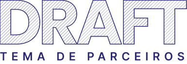

<h1 align="center">
    <br>
    
    <br>
</h1>
<br>
<p align="center">Esse repositório contem o código do <b>Tema de Parceiros</b> Draft, criado do total zero sem heranças de outros temas, bem testado para as variações de produtos, com estilos componentizados em SASS e fluxo de trabalho automatizado, pensado para ser utilizado como base para um desenvolvimento ágil e compatível com a Homologação Tray, atualmente na versão <b>1.0.0</b></p>
<p align="center"> Visualize o tema na loja:
    https://demo-partners-theme.commercesuite.com.br/
</p>

<div align="center" >
    
</div>
<br>
<br>
<div align="center">
    <a href="https://www.figma.com/file/HUThrLq4Pxx9Rrj9m6Tc99/Draft---Theme-Default---P%C3%BAblico?node-id=0%3A1" target="_blank" rel="noreferrer noopener" title="Abrir Layout do Tema no Figma">
        
    </a>
</div>


## 🎯 Melhorias Futuras

As próximas atualizações serão voltadas para as seguintes tarefas:
- [X] Todas as Páginas de Lista de Desejos
- [X] Todas as Páginas de Afiliados
- [ ] Menu com Navegação acessível por teclado

Consulte o [planejamento do projeto](https://github.com/tray-tecnologia/draft-partner-theme/issues?q=is%3Aissue+is%3Aopen+sort%3Acreated-asc) para mais detalhes.


## ⚡ Tecnologias

-   **HTML**
-   **CSS**
-    **JavaScript**
-    **SASS**


## ℹ️ Como Usar

#### ⚙️ Requisitos

-   Git
-   Gulp
-   Node JS


#### Iniciando o Desenvolvimento

```sh
# Instalar dependências:
$ npm install
# ou
$ yarn install

# Instalar o Gulp (caso não o possua em sua máquina):
$ npm install --global gulp-cli

# Para configurar um tema utilize: [key] [password] [theme-id]
$ npm run tray-c
# ou
$ yarn tray-c

# Para limpar todas as patas do tema configurado acima:
$ npm run tray-reset
# ou
$ yarn tray-reset

# Assistir a modificação dos arquivos em tempo real (compila e minifica os arquivos necessários) também abre e fica assistindo os arquivos html:
$ npm run dev
# ou
$ yarn dev
```

#### Para produção

```sh
# Faz o build para produção (altera a versão do tema para a definida no package.json e compila e minifica os arquivos necessários e envia todos os arquivos para a plataforma):
$ npm run deploy
# ou
$ yarn deploy
```

#### Para Instalar o Tema em um Cliente
> Ao utilizar esse comando, não subir as modificações para o github.

```sh
# Instale o tema de forma limpa em um cliente: [key] [password] [theme-id]
$ npm run client-install
# ou
$ yarn client-install

```

#### Para o Atualizar o Tema em um Cliente
> Ao utilizar esse comando, não subir as modificações para o github.

```sh
# Para atualizar um tema em um cliente que já o tenha instalado: [key] [password] [theme-id]
$ npm run client-update
# ou
$ yarn client-update
```


## :octocat: Contribua

Todos os tipos de contribuições são muito bem-vindas e apreciadas!

-   ⭐️ Estrelar o projeto
-   🐛 Localizar e relatar problemas
-   📥 Enviar PRs para ajudar a resolver problemas ou adicionar recursos
-   ✋ Influenciar o futuro do projeto com solicitações de recursos


## 🔖 Licença

Este projeto está licenciado sob a [GPLv3](LICENSE).

<p align="right"><kbd><b>
    <a href="#top">VOLTE PARA O TOPO 🔝</a>
</b></kbd></p>
